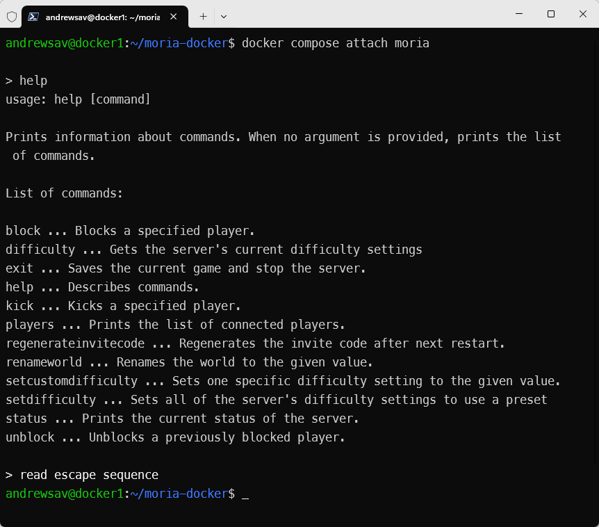

## Base information
The goal of this build is to enable running Return to Moria on Wine with all the latest features: staging-tkg-ntsync-wow64, on both arm64 and amd64 platforms.

## docker-compose.yml

```yaml
services:
  moria:
    image: tsxcloud/moria-arm:latest
    container_name: moria-arm
    restart: unless-stopped
    stop_signal: SIGINT # This is for graceful termination, do not change it, unless you know what you are doing
    volumes:
      - './server:/server'
    ports:
      - '7777:7777/udp'
    stdin_open: true # docker run -i, so we can issue commands to the console
    tty: true        # docker run -t, so we can attach to the console
    #This is required for ntsync to work inside Docker.
    #If ntsync support is not enabled in your Linux kernel, comment out this section, otherwise Docker Compose won't start.
#   devices:
#    - /dev/ntsync:/dev/ntsync
```

## Links
You can find the Docker builds here:
[https://hub.docker.com/r/tsxcloud/enshrouded-arm](https://hub.docker.com/r/tsxcloud/moria-arm)

> **Note:** This is a fork.  
> The following information is taken or adapted from the original project.
# Dockerized Return to Moria dedicated server in an Ubuntu 25.04 container with Wine. Works on ARM64

This is not an official project and I'm not affiliated with developers or publishers of the game. Head to https://www.returntomoria.com/news-updates/dedicated-server for official information / FAQ. Join the game Discord server at https://www.returntomoria.com/community to get help. This image is versioned separately and the image version is not in sync with either the game or the dedicated server.

Checked that it's working with 1.5.3 on 25 June 2025.

## Ports


| Exposed Container port | Type |
| ------------------------ | ------ |
| 7777                | UDP  |

In order for others to connect to your server you will most likely need to configure port forwarding on your router.

## Volumes


| Volume             | Container path              | Description                             |
| -------------------- | ----------------------------- | ----------------------------------------- |
| Steam install path | /server   | the server files are downloaded into this directory, and settings files are created here on the first start. server logs and saves are located under /server/Moria/Saved |

## Starting the server

In the folder containing `docker-compose.yaml` run

```bash
docker compose up -d --force-recreate
```

You can watch the logs with:

```bash
docker compose logs -f
```

*Note: this readme assumes that you are using supplied `docker-compose.yaml` to start the server. Some parts of this readme may be inaccurate if your settings differ from the provided.*

## Accessing server console

To attach to the console run:

```
docker compose attach moria
```

Then hit `enter` once or twice.

To detach, press:

```
CTRL+p CTRL+q
```

This may or may not work depending on your terminal, and on whether or not you are using `ssh`. It worked for me in most scenarios.



*Technical note: this docker image patches the dedicated server executable [windows subsystem](https://learn.microsoft.com/en-us/windows/win32/debug/pe-format#windows-subsystem) from GUI (2) to CUI (3) in order to provide access to the server console*

## Server configuration

Once the server fully started for the first time it will copy the default server settings to `./server/MoriaServerConfig.ini`, `./server/MoriaServerPermissions.txt`,`./server/MoriaServerRules.txt` files.

Edit the files to your liking and restart the containers:

```bash
docker compose up -d --force-recreate
```

Logs are found in `./server/Moria/Saved/Logs/` directory, and Saves are in `./server/Moria/Saved/SaveGamesDedicated/` directory.

You can now connect to your server from the game (providing that the port forwarding is set up correctly).

*Note: read the official notes linked at the top of this README, they will tell you how to set up a password, copy the game world from your single player playthrough and more*

## Connecting to the server

In game, after clicking "Join Other World", select "Advanced Join options". Use "Direct Join" section. Enter the server IP or domain name and the port number in the format prompted on that screen, and enter password if any. Click Join Server. You can also join via an invite code. The invite code is dumped in the container log, you can search for it with `docker compose logs | grep Invite` after the server has completed start up.

## Updating the server

Restart the container. It will check steam for the newer server version on start and update if required. My preferred method of restarting is running `docker compose up -d --force-recreate` but simple `docker restart moria` would suffice. 

## Additional Information

## Changing port

If you change port in `docker-compose.yaml` from `7777` to somethings else, e.g.:

```yaml
    ports:
      - '12345:7777/udp'
```

You will also need to update `MoriaServerConfig.ini` accordingly:

```ini
AdvertisePort=12345
```

### Port forwarding

Detailed port forwarding guide is out of scope of this document, there are a lot of variations between routers in how this is done. However here is a few important point to keep in mind:

- You need to forward port `7777` (unless you changed it to something else) on UDP protocol. Without this your server won't be accessible from the internet. You can use <https://mcheck.bat.nz/> to check if your server is accessible.
- It is possible, that the server is accessible from the internet but not from the same (home) network where your server is in. This is called a hairpin NAT problem. Either google how to configure it on your router (if it supports it), or use local IP address for connecting to the server within the same network (as opposed to your external IP address).
- Some internet providers employ [CGNAT](https://en.wikipedia.org/wiki/Carrier-grade_NAT). If yours does, you won't be able to make your server accessible externally, unless you and other users use a VPN or a tunneling service such as <https://playit.gg/> (this is not an endorsement, I have never used this service myself).

### Editing `MoriaServerConfig.ini`

There are a couple of things that can break this docker image, if you edit them in `MoriaServerConfig.ini` so please be aware:

- `docker-compose.yaml` and the docker image health check, expect the server port to be `7777`. You can easily change the mapped port to any value you want in `docker-compose.yaml` (e.g. to change port to `12345` use `1234:7777/udp`) which will work, but if you change `ListenPort` in `MoriaServerConfig.ini` it will break both `docker-compose.yaml` and the health check. I cannot think of a case where the internal container port needs changing, since changing the external container port is so easy, but if you must, you will have to make the adjustments to both `docker-compose.yaml` and `Dockerfile` and rebuild the image.
- If you change `[Console]` section from the default of `Enabled=true`, graceful termination and attaching to the console will stop working. The former because nothing can process `SIGINT` any more, and the latter because there is no console to attach to any longer. When graceful termination is not working, when you restart or down you container, the online session is not cleaned up which will prevent the server from starting until the session expires, which can take around 5 minutes

### Patcher

The [patcher](patcher) folder contains a patcher used by the image in order to make attaching to the console possible. It changes a single byte in the game server executable. Naturally, during the container start up, when steam verifies the integrity of the files it would be detected and some time would be spent on the "repair". To avoid that, before the integrity check a backup of the unpatched executable kept in `server/Moria/Binaries/Win64/MoriaServer-Win64-Shipping.bak` is moved over the patched executable before the verification. After verification/update the executable is patched again (and the backup is taken) before the server starts.

### Health check

The [healthcheck](healthcheck) folder contains an utility, which sends a UDP message to the server and checks if it receives a response. If no response is received the health check is assumed to fail. Please refer to the `HEALTHCHECK` directive in `Dockerfile` to see how the health check is configured. This can be overridden in your `docker-compose.yaml` if desired.

By and large the health check does not change how the image works. When you do `docker compose ps` or `docker ps` you will be able to see the health check result of the most recent health check. If you run `docker inspect --format='{{json .State.Health}}' moria | jq` (assuming you have `jq` installed), you will see the last few entries of health check log.

I've added the health check, because the server cannot function and shuts down if the connection to Epic Online Services goes down. When this was added, the community were seeing this happening quite often (several times a week). It seems to have improved somewhat with time, but maintenance downtime is still regular. When this happens, all the Moria servers no longer work, until EOS goes back up again.

Docker does not have a facility to restart unhealthy containers, but there are external solutions that can achieve the same. This is not an endorsement of any of the below.

- https://github.com/willfarrell/docker-autoheal - restarts unhealthy containers
- https://github.com/petersem/monocker - sends a notification on container change status

## About this docker image

See [APPROACH.md](APPROACH.md)

## Credits

- https://github.com/Theogalh/ReturnToMoriaServerOnLinuxTutorial
